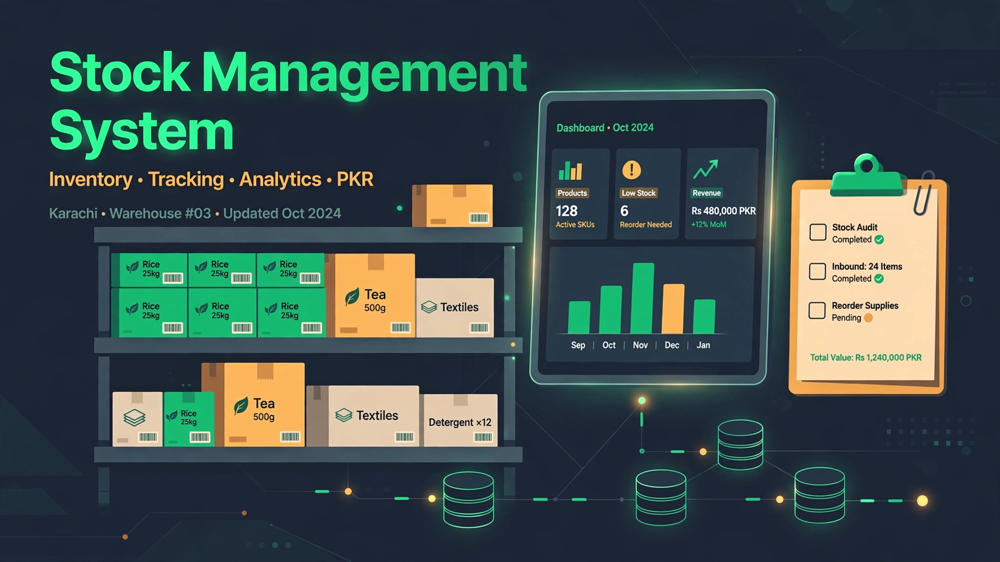

<div align="center">

# Stock Management System

### _A full-stack inventory tracker with JWT auth and a change-history log_


</div>

---

A **full-stack inventory app** — log in, add products with category, quantity and price (shown in PKR), update or delete them, and watch every change get recorded in a product-history log. The frontend is served by the same Express app that powers the API.

## ✨ Features

- **JWT authentication** — login issues a 24-hour token; every `/api/items` and `/api/history` route is guarded by token verification.
- **Full inventory CRUD** — add items with name, category, quantity and price; edit stock levels; delete items. Non-negative quantities/prices enforced on the server.
- **Product history log** — every add, update and delete writes a history entry, viewable on a dedicated history page (latest 100, newest first).
- **Dashboard with live stats** — total items and total stock value at a glance, updating as items change.
- **Login-gated frontend** — vanilla-JS dashboard, login page, and history page served straight from Express; protected pages redirect to login without a valid token.
- **Security helpers included** — middleware for Helmet-style headers, rate limiting, and CORS options live in `backend/middleware/`, plus a structured error handler.

> Demo credentials baked in for testing: username `DB`, password `0702`.

## 🛠️ Tech Stack

| Layer | Technology |
|:---|:---|
| Backend | Node.js, Express.js 5 |
| Database | MongoDB + Mongoose ODM |
| Auth | JSON Web Tokens (24h expiry) |
| Config | dotenv (`.env` in `backend/`) |
| Security deps | Helmet, CORS, express-rate-limit, bcryptjs |
| Frontend | HTML5, CSS3, vanilla JavaScript — served by Express |

## 🚀 Getting Started

**Prerequisites:** Node.js 18+ and MongoDB (a local instance or a MongoDB Atlas cluster).

```bash
# 1. Clone
git clone https://github.com/hussnainahmedd/stock-management-system.git
cd stock-management-system

# 2. Install backend dependencies
cd backend
npm install

# 3. Configure
#    Create backend/.env with:
#    PORT=5000
#    MONGODB_URI=mongodb://localhost:27017/stock_management
#    SECRET_KEY=your_super_secret_jwt_key

# 4. Run
node app.js        # or: npm run dev (nodemon)
```

Open **http://localhost:5000** — you'll land on the login page. Sign in with the demo credentials (`DB` / `0702`) and start adding stock.

## 📡 API Reference

Public:

| Method | Endpoint | Description |
|:---:|:---|:---|
| `POST` | `/api/login` | Authenticate with username/password, returns a JWT |

Protected (send `Authorization: Bearer <token>`):

| Method | Endpoint | Description |
|:---:|:---|:---|
| `GET` | `/api/items` | List all items (newest first) |
| `GET` | `/api/items/:id` | Get one item |
| `POST` | `/api/items` | Add an item (`name`, `category`, `quantity`, `price`) |
| `PUT` | `/api/items/:id` | Update an item |
| `DELETE` | `/api/items/:id` | Delete an item (logged in history) |
| `GET` | `/api/history` | Last 100 stock changes, newest first |

## 📁 Project Structure

```
stock-management-system/
├── backend/
│   ├── app.js                  # Express app: JWT auth + inline API routes
│   ├── config/db.js            # MongoDB connection
│   ├── models/
│   │   ├── Item.js             # Item schema (name, category, quantity, price)
│   │   ├── history.js          # History schema (action, item snapshot, timestamp)
│   │   └── user.js             # User schema (bcrypt-hashed password)
│   ├── middleware/
│   │   ├── security.js         # Helmet headers, rate limiter, CORS options
│   │   └── errorHandler.js     # Structured error responses
│   └── controllers/
│       └── itemController.js   # Controller stub (route handlers live in app.js)
└── frontend/
    ├── login.html              # Login page
    ├── index.html              # Dashboard (stats, items grid, add/edit/delete)
    └── product-history.html    # Change-history view
```

## 👀 Preview



---

<div align="center">

Built by **[Hussnain Ahmad](https://github.com/hussnainahmedd)** — learning by building, one system at a time.

</div>
